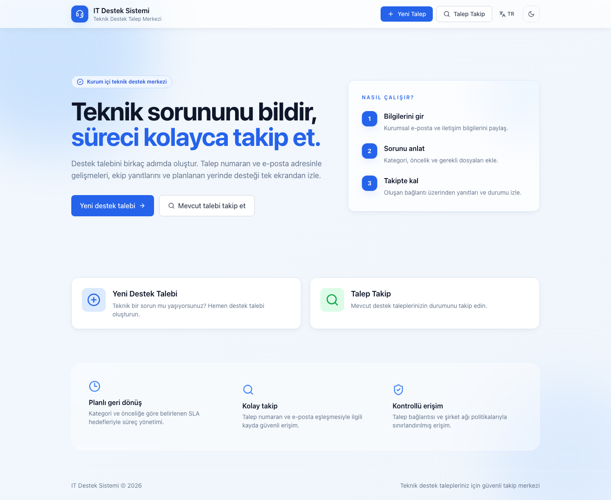
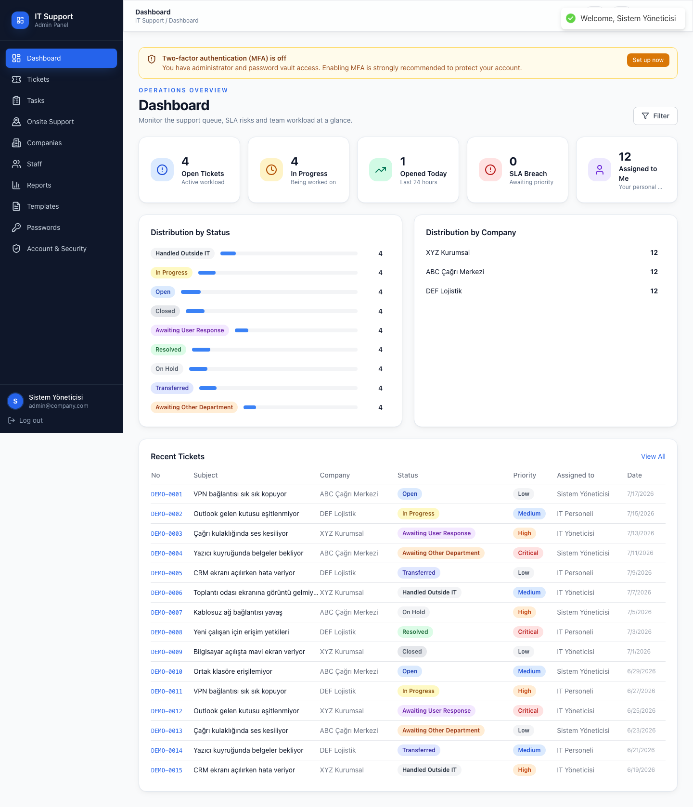
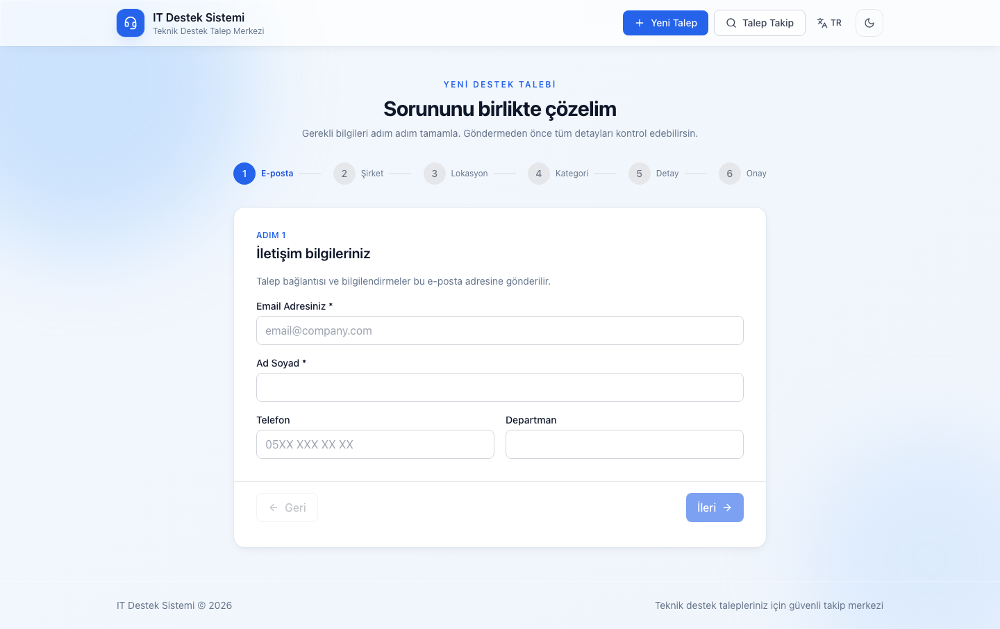
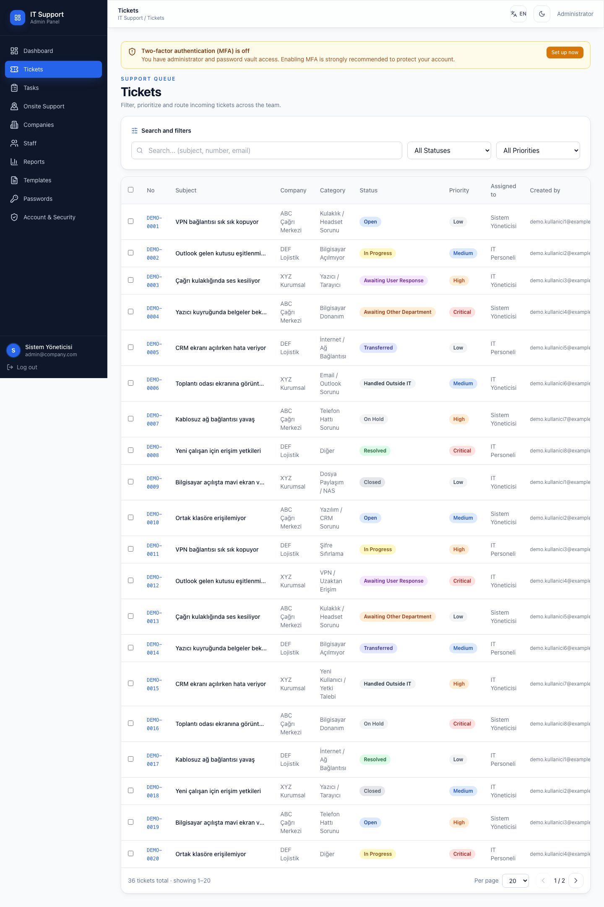

# IT Ticket System

Şirket içi IT destek süreçleri için dockerize edilmiş, çok şirketli (multi-tenant) ticket sistemi.
**Türkçe/İngilizce çift dil** arayüz (tarayıcı diline göre otomatik + anında geçiş). Talep edenler
için şifresiz public portal, IT ekibi için rollü yönetim paneli.

[](LICENSE)


> **English:** see [English summary](#english) below. Detailed docs are in Turkish.
>
> 📸 **[Ekran görüntüleri / Screenshots](#ekran-görüntüleri)** — tüm ekranlar TR & EN.

---

## Ne yapar?

**Talep eden (public, giriş yok):**
- Ticket oluşturur — şirket/lokasyon/kategori seçer, şirkete özel dinamik alanları doldurur, dosya ekler.
- Aldığı **erişim linki** ile ticket'ının durumunu canlı izler, yanıt yazar, ek dosya gönderir.
- Ticket numarası + e-posta ile geçmiş taleplerini sorgular.

**IT ekibi (staff paneli):**
- Dashboard: açık/kapalı ticket istatistikleri, SLA durumu, üzerine atanmış işler.
- Ticket yönetimi: liste/filtre/arama, detay, durum ve atama değişikliği, iç not (talep edene görünmez) ve public yanıt, toplu işlem.
- Yerinde destek takvimi: randevu oluşturma, süre seçimi, takvim görünümü.
- Görev yönetimi: ticket'tan bağımsız görevler, çoklu atama, yorumlar.
- Raporlar: ticket dağılımı, personel performansı, kategori kırılımı, SLA trendleri, CSV export.

**Yöneticiler (rol bazlı):**
- `admin` + `it_manager`: şirket/lokasyon/kategori/özel alan yönetimi, şirket bazlı SMTP, e-posta ve SMS şablonları, hazır yanıtlar, raporlar.
- `admin`: personel yönetimi ve **şifre kasası** (AES-256-GCM ile şifrelenmiş kurumsal şifreler, her görüntüleme audit log'lanır).

**Arka planda:**
- E-posta/SMS bildirimleri BullMQ kuyruğunda asenkron (3 deneme, exponential backoff).
- SLA kontrolü her 5 dakikada bir; kategori bazlı yanıt/çözüm süreleri.
- SSE (Server-Sent Events) ile panelde canlı güncelleme.
- Şirket bazlı branding: domain'e göre logo ve tema rengi.

**Çift dil (TR/EN):**
- Arayüz tarayıcı diline göre açılır; header'daki düğmeyle anında geçilir (tercih kalıcı).
- API hata/yanıt mesajları `Accept-Language`'e göre TR/EN döner.
- E-posta/SMS bildirimleri alıcının diline göre gönderilir (talep sahibi: portal dili,
  personel: panel dili). Şablonlar her iki dilde tohumlanır.

---

## Teknoloji

| Katman | Teknoloji |
|---|---|
| Backend | Node.js 22, Fastify 5, TypeScript (ESM), Prisma 6, Zod |
| Frontend | React 18, Vite 6, TypeScript, TailwindCSS 3, TanStack Query 5, Zustand 5 |
| Veritabanı | PostgreSQL 16 |
| Kuyruk / Cache | Redis 7 + BullMQ |
| Realtime | SSE |
| Çok dillilik | react-i18next (TR/EN), `Accept-Language` bazlı API mesajları |
| Deploy | Docker Compose (Coolify + Nginx Proxy Manager uyumlu) |

---

## Ekran görüntüleri

Tüm ekranlar hem Türkçe hem İngilizce olarak yakalanmıştır. Aşağıda birkaç örnek;
**[tam galeri için docs/screenshots →](docs/screenshots/)** (14 sayfa × TR/EN).

| Public portal (TR) | Yönetim paneli (EN) |
|---|---|
| [](docs/screenshots/public-home-tr.png) | [](docs/screenshots/staff-dashboard-en.png) |
| Talep oluşturma sihirbazı | Talep listesi (durum/öncelik rozetleri çift dilli) |
| [](docs/screenshots/public-create-ticket-tr.png) | [](docs/screenshots/staff-tickets-en.png) |

> Görselleri otomatik üretmek için (docker dev + seed ayaktayken):
> `cd frontend && node scripts/screenshots.mjs` — Playwright/chromium ile
> `docs/screenshots/` altına TR + EN yazar.

---

## Hızlı başlangıç (geliştirme)

**Gereksinim:** Docker + Docker Compose. Başka bir şey kurmana gerek yok.

```bash
git clone https://github.com/mahmutyum/ticket-system.git
cd ticket-system
cp .env.example .env
```

`.env` içinde **en az** şu dördünü doldur — hiçbirinin varsayılanı yok, boş bırakırsan backend açılmaz:

```bash
# Üretmek için:
openssl rand -base64 48   # JWT_SECRET      (min 32 karakter)
openssl rand -base64 48   # JWT_REFRESH_SECRET (min 32 karakter, JWT_SECRET'tan farklı)
openssl rand -hex 32      # CREDENTIALS_ENC_KEY (tam 64 hex karakter)
```

Ayrıca `DB_PASSWORD` ve `REDIS_PASSWORD` belirle — bu ikisini `DATABASE_URL` ve `REDIS_URL` içinde de **aynı** değerle güncellemeyi unutma.

Sonra başlat:

```bash
docker compose -f docker-compose.yml -f docker-compose.dev.yml up --build
```

Şema otomatik uygulanır. Örnek veriyi yükle:

```bash
docker compose exec backend npx tsx prisma/seed.ts
```

Liste, sayfalama ve rapor ekranlarını dolu veriyle incelemek için temel seed'den
sonra ilişkili sentetik senaryoları yükle:

```bash
docker compose exec backend npm run db:seed:demo
```

Bu komut 36 talep, 24 görev, 8 yerinde destek planı ve 24 şifre kasası kaydı
üretir. Tekrar çalıştırılabilir; demo görev ve kasa kayıtlarını yeniler, talepleri
benzersiz `DEMO-*` numaraları üzerinden günceller. Kullanılan e-posta, URL ve
parolaların tamamı kurgusaldır (`example.test`) ve production ortamında çalışması
kod seviyesinde engellenmiştir.

Arayüz: **http://localhost:1111** · API dokümantasyonu: **http://localhost:4000/docs**

### Örnek giriş bilgileri (seed)

| Rol | E-posta | Şifre |
|---|---|---|
| admin | `admin@company.com` | `admin123` |
| it_manager | `manager@company.com` | `staff123` |
| it_staff | `it@company.com` | `staff123` |

> ⚠️ Bunlar yalnızca demo/geliştirme içindir ve tahmin edilmesi önemsiz derecede kolaydır.
> **`prisma/seed.ts`'i asla production veritabanına karşı çalıştırma.** Production'da
> ilk admin'i elle oluştur veya seed'i çalıştırdıysan şifreleri hemen değiştir.

---

## Production

Detaylı anlatım: **[docs/kurulum.md](docs/kurulum.md)**

Kısaca — Coolify + Nginx Proxy Manager arkasında:

```
İnternet/VPN → NPM (SSL + FQDN) → frontend:1111 ─┬─ /              → SPA
                                                  ├─ /api/*         → backend:4000
                                                  ├─ /attachments/* → backend:4000  (yetki kontrollü)
                                                  └─ /branding/*    → backend:4000  (public logolar)
```

Ekler ve logolar diskten değil **backend üzerinden** servis edilir: token ve şirket
kapsamı kontrolleri orada yapılır.

```bash
cp .env.example .env   # değerleri doldur (Coolify'da panelden)
docker compose up -d --build
```

Sadece `frontend` host'a açılır (`FRONTEND_PORT`, varsayılan `1111`). Backend, Postgres ve Redis yalnızca dahili Docker network'ünde kalır.

> **Mevcut bir kurulumdan güncelliyorsan:** Bu proje `prisma db push` yerine
> versiyonlanmış migration'lara geçti. Zaten çalışan bir veritabanın varsa,
> `migrate deploy` "database schema is not empty" (P3005) hatası verir. Bir kereye
> mahsus baseline gerekir — adımlar [docs/kurulum.md](docs/kurulum.md#mevcut-veritabanını-baselineleme) içinde.

---

## Dokümantasyon

| Doküman | İçerik |
|---|---|
| [docs/kurulum.md](docs/kurulum.md) | Kurulum: geliştirme, production, Coolify/NPM, env değişkenleri, migration, sorun giderme |
| [docs/kullanim.md](docs/kullanim.md) | Kullanım: talep eden akışı, IT ekibi paneli, yönetici işlemleri |
| [docs/mimari.md](docs/mimari.md) | Mimari: modüller, veri modeli, auth, kuyruk, SSE, mimari kararlar |
| [docs/yol-haritasi.md](docs/yol-haritasi.md) | Bilinen eksikler ve yol haritası — katkı vermeden önce oku |
| [docs/operasyon.md](docs/operasyon.md) | Yedekleme, geri dönüş, retention ve sağlık kontrolleri |
| [docs/public-repo.md](docs/public-repo.md) | Public repo veri/secret politikası ve olay müdahalesi |
| [CONTRIBUTING.md](CONTRIBUTING.md) | Katkı rehberi, kodlama kuralları |
| [SECURITY.md](SECURITY.md) | Güvenlik açığı bildirimi ve bilinen güvenlik sınırları |

---

## Tasarım varsayımları — okumadan kurma

Bu sistem **iç ağ / VPN arkasında** çalışmak üzere tasarlandı. İnternete açık bir SaaS
olarak kurmadan önce şunları bil:

- Public ticket portalı **kimlik doğrulaması yapmaz**. Erişim, tahmin edilemez bir
  `accessToken` (nanoid) linkine dayanır. Link'i olan herkes o ticket'ı görebilir.
- Opsiyonel dahili nginx (`--profile proxy`) IP whitelist'i **RFC1918 özel ağlarla sınırlıdır**;
  dışarıdan gelen istekleri 403 ile reddeder.
- Bilinen güvenlik sınırları ve henüz yapılmamışlar [SECURITY.md](SECURITY.md) ve
  [docs/yol-haritasi.md](docs/yol-haritasi.md) içinde açıkça listelenmiştir.

---

## Lisans

[MIT](LICENSE) © Mahmut YUM

---

<a name="english"></a>

## English

**IT Ticket System** — a dockerized, multi-tenant internal IT helpdesk. **Bilingual
Turkish/English UI** (auto-detected from the browser, switchable instantly). Requesters
file and track tickets through a passwordless public portal (unguessable access-token
links); the IT team works them through a role-based staff panel.

**Features:** ticket lifecycle with per-category SLA, dynamic per-company custom fields,
file attachments, internal vs. public notes, on-site support calendar, task management,
reporting with CSV export, an admin-only AES-256-GCM credential vault with audit logging,
async email/SMS via BullMQ, live updates over SSE, per-domain company branding, and
**full TR/EN localization** (UI, API messages via `Accept-Language`, and email/SMS
templates in the recipient's language).

**Screenshots:** every screen in both TR & EN — see [docs/screenshots](docs/screenshots/).

**Stack:** Fastify 5 + Prisma 6 + PostgreSQL 16 + Redis 7 (backend), React 18 + Vite 6 +
TailwindCSS (frontend), Docker Compose (deploy).

**Quick start:**

```bash
git clone https://github.com/mahmutyum/ticket-system.git
cd ticket-system
cp .env.example .env
# Required, no defaults — generate each:
#   openssl rand -base64 48  → JWT_SECRET, JWT_REFRESH_SECRET
#   openssl rand -hex 32     → CREDENTIALS_ENC_KEY (exactly 64 hex chars)
# Also set DB_PASSWORD / REDIS_PASSWORD and mirror them into DATABASE_URL / REDIS_URL.
docker compose -f docker-compose.yml -f docker-compose.dev.yml up --build
docker compose exec backend npx tsx prisma/seed.ts   # demo data — never in production
```

UI at http://localhost:1111 · API docs at http://localhost:4000/docs
Demo login `admin@company.com` / `admin123` — **development only.**

**Important:** this is designed to run **behind a VPN / on an internal network**. The public
portal is intentionally unauthenticated, and the optional bundled nginx whitelists RFC1918
ranges only. Read [SECURITY.md](SECURITY.md) for known security limits before exposing it
to the internet.

**Docs are in Turkish:** [installation](docs/kurulum.md) · [usage](docs/kullanim.md) ·
[architecture](docs/mimari.md) · [roadmap & known gaps](docs/yol-haritasi.md) ·
[public repository safety](docs/public-repo.md) ·
[contributing](CONTRIBUTING.md)

**License:** [MIT](LICENSE) © Mahmut YUM
